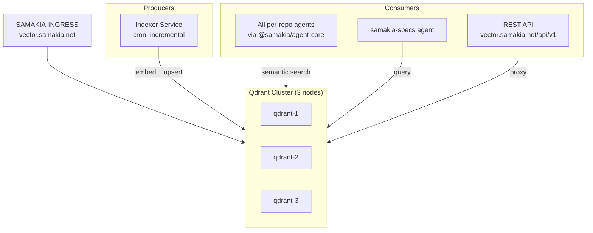

# SAMAKIA-VECTOR

Clustered vector search platform for the Samakia ecosystem. Provides semantic code search, embeddings storage, and RAG context retrieval for all per-repo agents.

## Architecture

## Cluster Topology

| Node | Host | Port | Role |
|------|------|------|------|
| qdrant-1 | via Docker | 6333 | Leader |
| qdrant-2 | via Docker | 6334 | Replica |
| qdrant-3 | via Docker | 6335 | Replica |

## Collections

| Collection | Scope | Content |
|-----------|-------|---------|
| `code-{repo}` | Per repo | Source files (ts, js, tsx, jsx) |
| `docs-{repo}` | Per repo | Markdown documentation |
| `contracts` | Ecosystem | All CONTRACTS.md, AGENTS.md, specs |
| `errors` | Ecosystem | Error→fix knowledge base |

## API Surface

- `POST /api/v1/search` — semantic search across collections
- `POST /api/v1/embed` — generate embedding for text
- `POST /api/v1/index` — index a file/document
- `GET /api/v1/collections` — list collections
- `GET /api/v1/health` — cluster health
- `DELETE /api/v1/collection/{name}` — drop collection

## Ingress

- Hostname: `vector.samakia.net`
- Internal: Docker network `samakia-edge-net`

## Stack

- Qdrant (latest, clustered mode)
- Node.js API proxy (thin REST layer)
- Ollama `nomic-embed-text` for embeddings
- Docker Compose with replication

## Documentation

- `docs/README.md`
- `docs/cluster-operations.md`
- `docs/api-reference.md`
